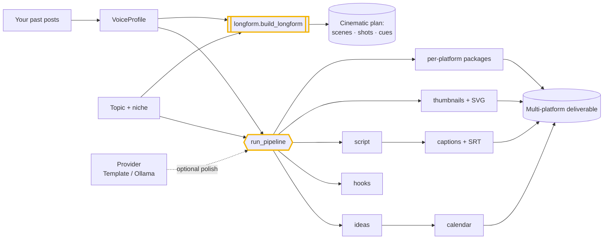

# creatorforge

**The AI content team you _own_ — not one you rent for $15K/month.**

---

Business owner? Creator? Ask yourself:

- Are you paying (or about to pay) **five figures a month** for a "done-for-you AI content team"?
- Does that team's "proprietary system" run on **someone else's servers**, with your voice, audience, and data living there?
- When the retainer ends, do you **keep anything** — or does the system walk out the door with them?
- Do you actually want to film 2–4 hours a week and have everything else handled — **without renting the engine that does it**?

If you nodded, here's the deal: `creatorforge` is that content team, as **open software you own and run yourself**. No retainer. No 50-spots-only. No "proprietary" black box. It's free, COCL (Cognis Open Collaboration License), and runs on *your* hardware and *your* model.


## Watch the walkthrough

A full narrated tour — setup, the tool in action, and every demo scenario:

[](https://github.com/cognis-digital/creatorforge/releases/download/walkthrough-v1/walkthrough.mp4)

▶ **[Watch the walkthrough (MP4)](https://github.com/cognis-digital/creatorforge/releases/download/walkthrough-v1/walkthrough.mp4)**

## What you get

The same deliverables an agency installs — generated from one command:

- **Voice profile** — it learns your style from your past posts (no model training, nothing uploaded — just measurable style features).
- **Niche research brief** — content pillars, audience pains, keyword targets.
- **Content ideas** — a steady pipeline of format × angle ideas so you never face a blank page.
- **Hooks** — proven scroll-stopping formulas, written in your voice.
- **Scripts** — full, structured scripts sized to each platform.
- **Captions** — on-screen overlay text + timed SRT subtitles.
- **Thumbnail concepts** — headline / visual / emotion / layout, **rendered as actual SVG mockups**.
- **Multi-platform packaging** — one idea, tailored for YouTube, Shorts, TikTok, Reels, X, and LinkedIn (each platform's limits respected).
- **Posting calendar** — your ideas scheduled at your cadence.

You film. creatorforge does the rest.

## How it's different (the honest version)

| | The agency offer | **creatorforge** |
|---|---|---|
| Price | ~$15K/month retainer | **free, open source** |
| Where it runs | their cloud | **your hardware** |
| Your voice/data | lives on their system | **never leaves your machine** |
| When it ends | you keep nothing | **you own it forever** |
| The "system" | proprietary black box | **readable code you can audit** |
| Results promised | "1 billion views" | **a great engine — the views are on you** |

No inflated view-count promises here. creatorforge gives you a genuinely strong content *system*; what it can't do is guarantee virality, and anyone who guarantees that is selling something. It runs **fully offline** on a deterministic engine, and gets sharper the moment you point it at a local model (Ollama) or a cloud one — your call.

## Quick start

```bash
pip install -e .

# 1. Learn your voice from a folder of your past posts/scripts
creatorforge profile ./my_posts/ --out voice.json

# 2. Run the whole team on a topic, across your platforms
creatorforge pipeline --topic "why you should own your AI stack" \
    --niche "AI for business" --platforms youtube,tiktok,x,linkedin \
    --voice voice.json --start 2026-07-06 --out plan.json

# Or one piece at a time
creatorforge hooks    --topic "cold email that converts" --voice voice.json
creatorforge script   --topic "cold email that converts" --platform youtube_shorts --voice voice.json
creatorforge thumbnail --topic "cold email that converts" --svg thumb     # writes thumb-1.svg …

# Use your own local model to sharpen the prose (nothing leaves your machine)
creatorforge script --topic "..." --provider ollama --model llama3
```

Run `python demo.py` to watch it learn a voice and generate a full multi-platform plan end to end.

## Platforms

| Platform | Aspect | Sweet spot | Tailored output |
|----------|--------|-----------|-----------------|
| YouTube | 16:9 | ~10 min | title + description + script |
| YouTube Shorts | 9:16 | ≤60 s | short script + captions |
| TikTok | 9:16 | ~27 s | caption + hashtags + script |
| Reels | 9:16 | ~60 s | caption + hashtags + script |
| X | 16:9 | — | ≤280-char post |
| LinkedIn | 1:1 | ~90 s | long-form post |

## Local models — every modality, on your hardware

creatorforge drives the best **open-source, local, free** model your machine can run, in every modality — and degrades cleanly when you don't have the big one. Ask it what it can do:

```bash
creatorforge capabilities
```

| Modality | What it does | Open model (GPU) | Runs with no GPU |
|----------|-------------|------------------|------------------|
| **Text** | hooks, scripts, ideas in your voice | any Ollama model (auto-picks your best) | ✅ via Ollama / template engine |
| **Transcription** | footage → text → repurposed posts | faster-whisper `large-v3` | ✅ `base`/`small` on CPU |
| **Voice** | voiceover + **voice cloning** | XTTS-v2 (clone) | ✅ Piper (CPU) |
| **Image** | photorealistic thumbnails | FLUX.1-schnell / SDXL-Turbo / SD 1.5 | ✅ real raster PNG (PIL) → SVG |
| **Video** | finished short, captions timed | LTX-Video / CogVideoX (text-to-video) | ✅ assembled MP4 (ffmpeg) / animated GIF |
| **Audio** | voiceover + music, leveled | MusicGen beds | ✅ ffmpeg mix / stdlib WAV |

The recommended model in each row is chosen to fit your VRAM (`recommend()` ladders from a 24 GB GPU down to CPU). Photorealistic images, cloned voices, MP4s, and generated b-roll need the model/tool installed — but there's always a **real, local fallback** so nothing hard-fails: a composited raster thumbnail, an animated GIF, a synthesized WAV. Nothing is ever sent to a cloud API.

```bash
# transcribe footage with local Whisper
creatorforge transcribe talk.mp4

# generate a thumbnail (diffusion if you have it, else a real raster PNG)
creatorforge image --topic "owning your AI stack" --voice voice.json --out thumb

# produce a finished short from a script (MP4 with ffmpeg, else animated video)
creatorforge video --topic "owning your AI stack" --platform youtube_shorts --out short

# voiceover (Piper, or clone your voice with XTTS) and an audio track
creatorforge voiceover --from-script script.json --out vo.wav --speaker my_voice.wav
creatorforge audio --voiceover vo.wav --music bed.mp3 --out track

# the whole production in one command: plan + thumbnail + video + audio + outbox
creatorforge produce --topic "owning your AI stack" --niche "AI for business" \
    --provider ollama --out ./production/
```

## Long-form & cinematic production (5–15 min)

Short clips are one mode. creatorforge also plans and assembles **long-form** video — documentaries, video essays, dev logs, promos — structured the way the industry actually does it. It fuses four things:

- a **format** (`creatorforge formats`) — the proven beat order for documentary / video-essay / devlog / promo
- a **cinematic style** (`creatorforge styles`) — pacing, shot vocabulary, color, and music mood drawn from the grammar of prestige docs, kinetic vlogs, trailer-cut blockbusters, slow-burn arthouse, true-crime, and more
- the **algorithm playbook** — what each platform actually rewards (watch time / AVD, completion rate, the first-30s hook, re-hooks every ~40s, chapters) turned into concrete production directives
- your **voice** (+ an optional local model to polish the narration)

…into a full plan: acts → scenes → timed shots → narration → chapters → a music & SFX cue sheet → titles and thumbnails, sized to your target runtime.

```bash
creatorforge formats        # documentary, video_essay, devlog, promotional
creatorforge styles         # epic_doc, true_crime, kinetic_vlog, blockbuster, arthouse_slowburn, …
creatorforge longform --topic "owning your AI stack" --format documentary --style epic_doc --minutes 12 --out plan.json
creatorforge studio   --topic "owning your AI stack" --format documentary --minutes 10 --provider ollama --out ./film/
```

Generative **music and sound effects** come from local open models (MusicGen / AudioGen) when your GPU can run them, with a synthesized bed as a fallback so a cut always has a track.

> **On "Netflix-level":** creatorforge plans and directs at that structural level — story structure, shot lists, pacing, sound design, retention engineering — and assembles the cut with whatever render models you have. Cinema-grade *footage and audio* come from the heavy open models (FLUX / LTX-Video / MusicGen / XTTS) on a capable GPU, which the engine drives; on a laptop you still get a complete, correctly-structured cut with real generated assets. The structure is studio-grade everywhere; the render fidelity scales with your hardware.

## Punch above your weight class: real photos, designed

You don't beat a giant cloud image model on a laptop by out-rendering it — you **out-source and out-design** it. creatorforge pulls *real, no-watermark* photography and composites it into pro visuals, which reads as more professional than weak CPU diffusion ever will.

- **Your own library, offline.** Index image folders you already have and search them by keyword — multiple related shots per scene, your images, zero watermarks, zero licensing questions. Optionally caption them with local `llava` for smarter matching.
- **Free, no-key, no-watermark CC stock.** Openverse / Wikimedia Commons, each result carrying its license + attribution so you stay compliant. Watermarked sources (Getty/Shutterstock previews) are never queried.
- **Designed, not dumped.** A sourced hero photo gets cover-cropped, color-graded, given a legibility scrim, and set with a bold headline — a real editor's thumbnail.

```bash
# build an offline, searchable index of your image folders (your own = no watermark)
creatorforge assets index ~/Pictures ~/b-roll --out assets.json

# pull multiple related, key shots for a scene
creatorforge assets search "datacenter server racks" --index assets.json -k 6
creatorforge assets search "founder at laptop" --index assets.json --online   # + free CC stock

# build a thumbnail composited over a real sourced photo
creatorforge image --topic "owning your AI stack" --assets assets.json --out thumb
# studio/produce auto-source a hero from your library:
creatorforge studio --topic "..." --format documentary --assets assets.json --out ./film/
```

> Licensing, honestly: your own library is yours. Openverse/Wikimedia results are Creative Commons / public-domain and **may require attribution** — creatorforge surfaces the license and attribution string with every result so you can credit correctly. It never pulls watermarked or paid-preview imagery.

## Direction & engagement craft (multi-cam, cool shots, retention)

Long-form plans don't just have scenes — they have **coverage and engagement built in**:

- **Multi-camera shot generation.** Every beat gets a shot list across A/B/C/detail/drone/POV cameras with motivated **camera moves** — dolly-in, push-in, crane, gimbal track, **drone reveal**, **dolly-zoom (vertigo)**, orbit, speed-ramp — and the showy "cool shots" land where they matter (cold opens, turns, climaxes). The plan tells you exactly which cameras a production needs.
- **Engagement craft, encoded.** Each beat carries a **retention move** drawn from two lineages: great-filmmaker grammar (in-media-res, but/therefore causality, show-don't-tell, escalating stakes, tension-release, match cuts, the Kuleshov effect) and modern retention tactics (front-load the payoff, escalate every segment, reset the hook on a cadence, concrete stakes/numbers, no dead air, tease what's coming, emotional payoff). Structure isn't just correct — it's *sticky*.

It's all in the `longform`/`studio` plan: `scenes[].shots` (cams + moves), `scenes[].retention_move`, `multicam`, and `engagement_plan`.

## Make content for your repos — and grow like the AI companies that made it

Point creatorforge at a repository and it writes the content **for** it; point it at an owner and it does the whole catalog.

```bash
# one repo -> multi-platform content (reads the README, derives what it is)
creatorforge repo ./codegraph-mcp --format promotional --out plan.json
creatorforge repo cognis-digital/agentledger --longform --format documentary   # via gh

# every repo of an owner, batched
creatorforge repos --owner cognis-digital --format promotional --out ./repo_content/

# a 30-day launch strategy that mirrors how the big AI companies actually grew
creatorforge growth ./codegraph-mcp
```

The **growth playbook** encodes the plays that repeatedly worked for the AI companies that broke out — a runnable demo over a pitch deck, building in public, a benchmark moment, developer-first distribution, founder-led content, free/open core, naming the category — and turns them into a concrete day-by-day launch calendar for your project. The edge was never the secret; it's executing these consistently, which is exactly what the engine makes cheap.

## Wire it into your stack (MCP)

creatorforge ships an **MCP server**, so Claude, an internal orchestrator, or any MCP-capable agent can drive it directly:

```bash
creatorforge serve     # JSON-RPC over stdio
```

Tools: `profile_voice`, `generate_ideas`, `write_hooks`, `write_script`, `thumbnail_concepts`, `package_for_platform`, `run_pipeline`. Hand the packaged posts to your scheduler/poster of choice and the loop is closed.

## The pipeline



See [`docs/ARCHITECTURE.md`](docs/ARCHITECTURE.md) for the full walkthrough.

## Demos

Five runnable scenarios in [`demos/`](demos/), each for a different audience.
Every one runs **fully offline** — no network, GPU, or model download — on the
deterministic engine, so they double as smoke tests. Details in
[`docs/DEMOS.md`](docs/DEMOS.md).

```bash
# cp1252 consoles (Windows): PYTHONUTF8=1 makes the emoji output render
PYTHONUTF8=1 python demos/run_all.py            # all five, end to end
PYTHONUTF8=1 python demos/02_agency_full_pipeline.py   # or just one
```

| # | Scenario | Audience | What it shows |
|---|----------|----------|---------------|
| 1 | `01_creator_voice_to_post.py` | Solo creators | Learn a voice from past posts, then write hooks, a script, overlays, and SRT in that voice. |
| 2 | `02_agency_full_pipeline.py` | Business owners | The whole agency bundle from one `run_pipeline` call — brief, ideas, hooks, script, captions, packages, calendar. |
| 3 | `03_devrel_repo_launch.py` | DevRel & marketing | Point it at a repo (reads the README), get multi-platform content + a 30-day launch calendar. |
| 4 | `04_multiplatform_repurpose.py` | Multi-platform publishers | One idea packaged for all six channels with every limit honored, plus the algorithm playbook. |
| 5 | `05_longform_studio.py` | Long-form showrunners | A 12-minute documentary plan: scenes, multi-cam shot lists, retention moves, chapters, titles. |

## Testing

```bash
pip install -e ".[dev]"
pytest -q          # 49 tests
```

## License

COCL (Cognis Open Collaboration License). © Cognis Digital. The whole engine is open — read it, fork it, run it on your own models. You own your content team.

> Status: v0.1 — runnable and tested. Short-form + long-form (5–15 min) production; text, transcription, voice, image, video, music/SFX backends wired with hardware-aware selection and CPU fallbacks; format/style/algorithm intelligence baked in. Roadmap: ComfyUI image/video backend, true text-to-video assembly, A/B title scoring, scheduled auto-publish.
