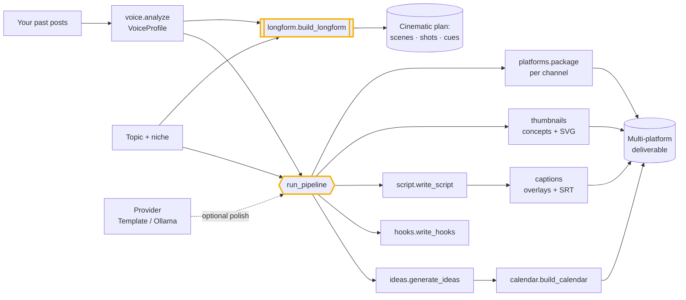

# Architecture

`creatorforge` is a local-first content engine: from one topic (and, optionally,
your learned voice) it produces the full bundle an agency installs — research
brief, ideas, hooks, scripts, captions/SRT, thumbnails, per-platform packages, a
calendar, and full long-form production plans. Everything below runs on your
hardware. A model provider is an *optional enhancer*, never a requirement.

## The content pipeline

## Components

### Voice profiling (`creatorforge/voice.py`)
Learns a creator's recognizable style from a corpus of their own posts using the
standard library alone — sentence length, reading grade, emoji and ALLCAPS
habits, list usage, niche vocabulary, and CTA phrasing. Nothing is uploaded and
nothing is trained; the resulting `VoiceProfile.style_brief()` conditions every
generator (and doubles as system context for a model provider).

### Providers (`creatorforge/providers.py`)
The pluggable backend. `TemplateProvider` is the default — fully deterministic,
zero dependencies, offline — and returns the engine's own structured output
untouched. `OllamaProvider` rewrites that scaffold into sharper prose with a
*local* model (nothing leaves the machine) and degrades gracefully to the input
if the model is unreachable, so a pipeline never breaks.

### Generators (pure functions)
Each produces real, structured content deterministically:
- **`ideas.generate_ideas`** — crosses proven formats × angles into a de-duplicated idea pipeline, each tagged with the platforms it fits.
- **`hooks.write_hooks`** — instantiates scroll-stopping hook *formulas* for the topic and styles them to the voice; an optional provider rewrites them in one call.
- **`script.write_script`** — a hook + intro + value beats (point/detail/b-roll) + CTA, sized to the target platform's ideal length.
- **`captions`** — `to_overlays` turns beats into on-screen lines; `to_srt` times the spoken track into standard SRT cues.
- **`thumbnails`** — proposes headline/visual/emotion/layout concepts and renders each as an actual 1280×720 SVG.

### Platforms (`creatorforge/platforms.py`)
The constraint layer. `PLATFORMS` encodes each channel's aspect ratio, length
sweet spot, title/caption limits, and hashtag norms; `package` takes one core
idea and produces a ready-to-post deliverable that respects them (clipping to X's
280, formatting LinkedIn's first-line hook, etc.).

### Calendar (`creatorforge/calendar.py`)
Spreads a pile of ideas across the week at a chosen cadence with explicit dates,
assigning each to a platform it fits — reproducible and diff-friendly.

### Pipeline (`creatorforge/pipeline.py`)
The one call that does what the agency's team does in a week. A `ContentBrief`
goes in; a research brief, ideas, hooks, primary script, captions, thumbnails,
per-platform packages, and (with a `start_date`) a calendar come out.

### Long-form engine (`creatorforge/longform.py`)
Fuses a **format** (`formats.py` — beat order), a **cinematic style**
(`styles.py`), the **algorithm playbook** (`playbook.py`), and **engagement
craft** (`engagement.py`) with multi-camera **coverage** (`camera.py`). It
allocates a 5–15 min runtime across beats into timed scenes with shot lists,
per-beat retention moves, narration, a music/SFX cue sheet, chapters, titles, and
thumbnails — the plan a showrunner hands a crew.

### Repo → content (`creatorforge/repos.py`) and growth (`creatorforge/growth.py`)
Point the engine at a repository (local path or `owner/name` via `gh`); it parses
the README to derive what the project is and runs the pipeline or long-form engine
*for* it. `growth.launch_strategy` turns the well-documented plays behind the AI
breakouts into a concrete 30-day launch calendar.

### MCP server (`creatorforge/mcp_server.py`)
Serves the engine to any MCP-capable agent over stdio: `profile_voice`,
`generate_ideas`, `write_hooks`, `write_script`, `thumbnail_concepts`,
`package_for_platform`, `run_pipeline`.

## Why these choices

- **Offline by default.** The deterministic `TemplateProvider` path needs no
  network, GPU, or model download — so the engine (and every demo) always runs.
- **Your voice, your machine.** Voice profiling is measured, not trained; nothing
  is uploaded. A local model is an option you control, never a dependency.
- **Deterministic and diffable.** Same inputs give the same output, so you can
  regenerate, review, and version content — and the demos double as smoke tests.
- **Own it forever.** It's readable code under COCL, not a rented black box.
